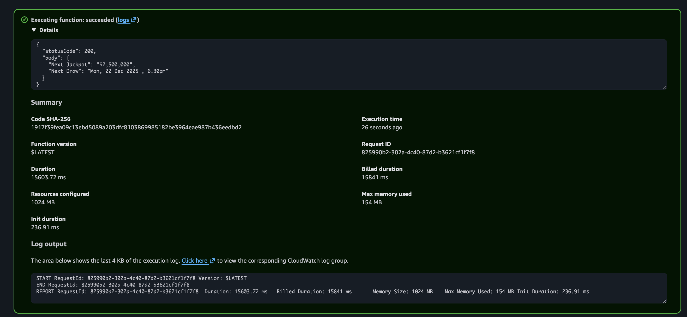

Project: Got Buy Got Hope (Loosely Translated from 有买有希望)

Idea:
Telegram Bot that can either be subscribed to or added to groups to check the next jackpot and draw amount.
If draw amount exceeds a certain pre-set amount, it will include a funny line like "有买有希望" (buy got hope), or any other funny quotes.

Planned Technical Implementation Steps:

1. Test script locally.
2. Upload it to AWS Lambda and validate.

Branches Overview:

1. Main - Browserless + Playwright + Lambda (current, working)
2. playwright-docker-lambda - Full Playwright + Chromium in Lambda (deprecated)

Intitial Approach: Dockerise Playwright and try to run it entirely within Lambda. Docker Image was hosted on Amazon ECR.
Although it was working, it would not be a fully free approach, costing about ~$0.02USD/month.
Albeit marginal, I opted for a workaround (Browserless) for a fully-free solution so that this solution can run in perpetuity.

At the time of development (December 2025), Browserless offered a free tier that was adequate for low-frequency, personal automation use cases such as this project.

Challenges Faced:

1. Docker Desktop produced an OCI image index (multi-arch), which AWS Lambda does not support.

Solution:

- Force linux/amd64 and disable provenance & SBOM
  Error Message:

```
The image manifest, config or layer media type for the source image 383675638173.dkr.ecr.ap-southeast-1.amazonaws.com/toto-browserless-lambda@sha256:9e750709f1c44b00b3142cdb44628d55dfac072ede6330f9bb983a20bd5333ca is not supported.
```

Solution:
a. changing docker file to CMD ["python", "-m", "awslambdaric", "lambda_function.lambda_handler"]
b. Building docker image differently via the command below:

```
docker buildx build \
  --platform linux/amd64 \
  --provenance=false \
  --sbom=false \
  -t 383675638173.dkr.ecr.ap-southeast-1.amazonaws.com/toto-browserless-lambda:latest \
  --push .
```

2. Testing Lambda
   Error Message:

```
{
  "errorMessage": "2025-12-21T06:14:47.123Z 9eef0a0b-f015-40aa-995a-83faae5f105a Task timed out after 3.01 seconds"
}
```

Solution: Increase timeout and Memory. Successful.

